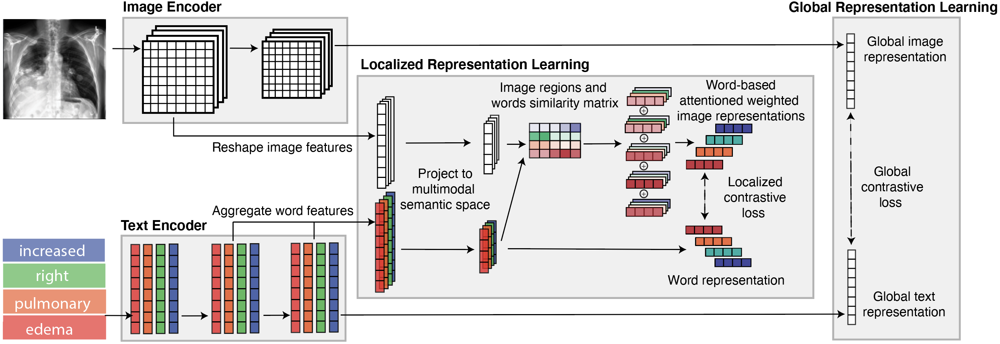

# GLoRIA: A Multimodal Global-Local Representation Learning Framework for Label-efficient Medical Image Recognition

GLoRIA (**G**lobal-**Lo**cal **R**epresentations for **I**mages using **A**ttenion) is a multimodal representation learning framework for label-efficient medical image recognition. Our results demonstrate high-performance and label-efficiency for image-text retrieval, classification (finetuning and zeros-shot settings), and segmentation on different medical imaging datasets. 

>**[GLoRIA Manuscript](https://openaccess.thecvf.com/content/ICCV2021/html/Huang_GLoRIA_A_Multimodal_Global-Local_Representation_Learning_Framework_for_Label-Efficient_Medical_ICCV_2021_paper.html)** \
> Shih-Cheng Huang (Mars), Liyue Shen, Matthew P. Lungren, Serena Yeung <br> 
> Stanford University <br>
> Proceedings of the IEEE/CVF International Conference on Computer Vision (ICCV), 2021 <br>

## Approach


## Usage

Start by [installing PyTorch 1.7.1](https://pytorch.org/get-started/locally/) with the right CUDA version, then clone this repository and install the dependencies.  

```bash
$ conda install pytorch==1.7.1 torchvision==0.8.2 torchaudio==0.7.2 cudatoolkit=10.1 -c pytorch
$ pip install git@github.com:marshuang80/gloria.git
$ conda env create -f environment.yml
```

Make sure to download the pretrained weights from [here](https://stanfordmedicine.box.com/s/j5h7q99f3pfi7enc0dom73m4nsm6yzvh) and place it in the `./pretrained` folder.

### Load GLoRIA pretrained models 
```python
import torch
import gloria

# get device
device = "cuda" if torch.cuda.is_available() else "cpu"

# load classifier
num_class = 5   # 5 class classification
freeze = True   # freeze encoder and only train linear classifier (less likely to overfit when training data is limited)
model = gloria.load_img_classification_model(num_cls=num_class, freeze_encoder=freeze, device=device)

# load segmentation model (UNet)
seg_model = gloria.load_img_segmentation_model(device=devices)
```

### Zeroshot classification for CheXpert5x200
```python
import torch
import gloria
import pandas as pd 

df = pd.read_csv(gloria.constants.CHEXPERT_5x200)

# load model
device = "cuda" if torch.cuda.is_available() else "cpu"
gloria_model = gloria.load_gloria(device=device)

# generate class prompt
# cls_promts = {
#    'Atelectasis': ['minimal residual atelectasis ', 'mild atelectasis' ...]
#    'Cardiomegaly': ['cardiomegaly unchanged', 'cardiac silhouette enlarged' ...] 
# ...
# } 
cls_prompts = gloria.generate_chexpert_class_prompts()

# process input images and class prompts 
processed_txt = gloria_model.process_class_prompts(cls_prompts, device)
processed_imgs = gloria_model.process_img(df['Path'].tolist(), device)

# zero-shot classification on 1000 images
similarities = gloria.zero_shot_classification(
    gloria_model, processed_imgs, processed_txt)

print(similarities)
#      Atelectasis  Cardiomegaly  Consolidation     Edema  Pleural Effusion
# 0       1.371477     -0.416303      -1.023546 -1.460464          0.145969
# 1       1.550474      0.277534       1.743613  0.187523          1.166638
# ..           ...           ...            ...       ...               ...
```

## Training

This codebase has been developed with python version 3.7, PyTorch version 1.7.1, CUDA 10.2 and pytorch-lightning 1.1.4. 
Example configurations for pretraining and downstream classification can be found in the `./configs`. All training and testing are done using the `run.py` script. For more documentation, please run: 

```bash 
python run.py --help
```

The preprocessing steps for each dataset can be found in `./gloria/datasets/preprocess_datasets.py`

### Representation Learning

Train the representation learning model with the following command: 

```bash 
python run.py -c ./configs/chexpert_pretrain_config.yaml --train
```

* Please note that the CheXpert radiology reports are still under PHI review for HIPPA compliency, and not publicly availible yet.  

### Classification 

Fine-tune the GLoRIA pretrained image model for classification with the following command: 

```bash 
# chexpert
python run.py -c ./configs/chexpert_classification_config.yaml --train --test --train_pct 0.01
# pneumonia
python run.py -c ./configs/pneumonia_classification_config.yaml --train --test --train_pct 0.01
```

The **train_pct** flag randomly selects a percentage of the dataset to fine-tune the model. This is use to determine the performance of the model under low data regime.

## Segmentation

Fine-tune the GLoRIA pretrained image model for segmentation with the following command: 

```bash 
# chexpert
python run.py -c ./configs/pneumothorax_segmentation_config.yaml --train --test --train_pct 0.01
```

### Citation

```
@inproceedings{huang2021gloria,
  title={GLoRIA: A Multimodal Global-Local Representation Learning Framework for Label-Efficient Medical Image Recognition},
  author={Huang, Shih-Cheng and Shen, Liyue and Lungren, Matthew P and Yeung, Serena},
  booktitle={Proceedings of the IEEE/CVF International Conference on Computer Vision},
  pages={3942--3951},
  year={2021}
}
```

#### Acknowledgements
This codebase is adapted from [ControlGAN](https://github.com/mrlibw/ControlGAN)
